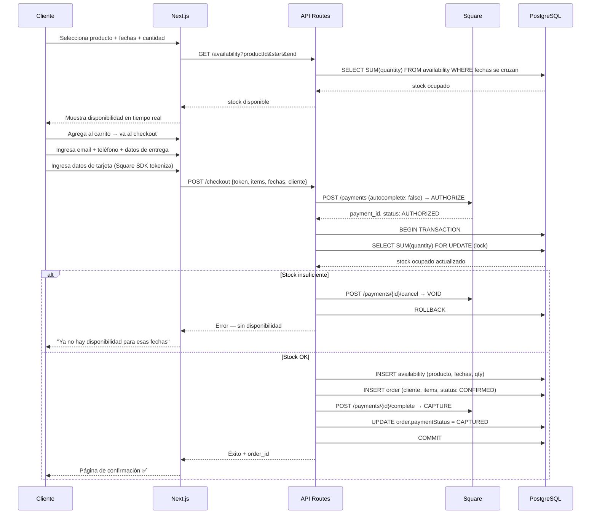
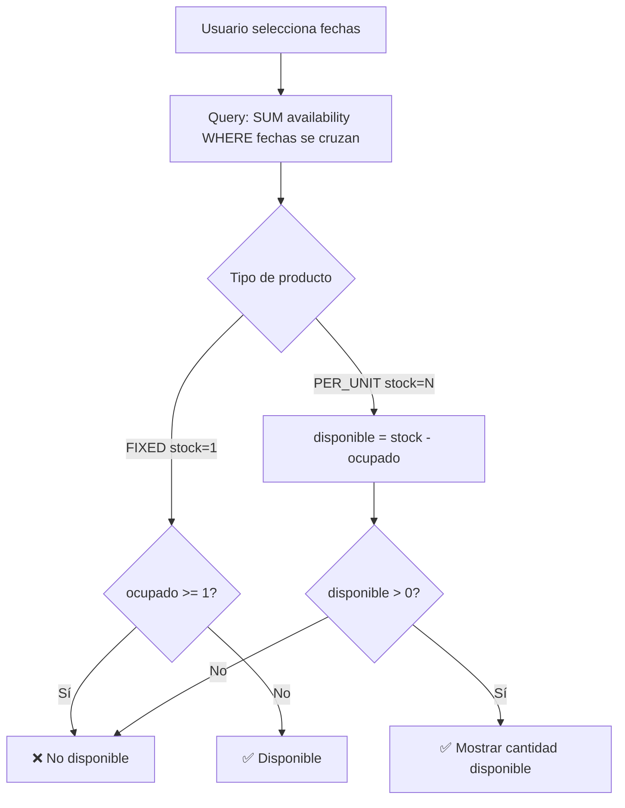
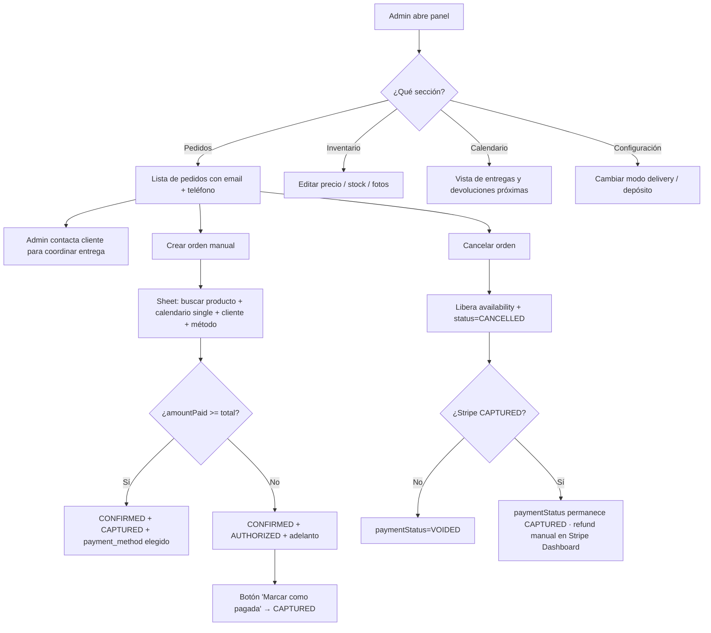
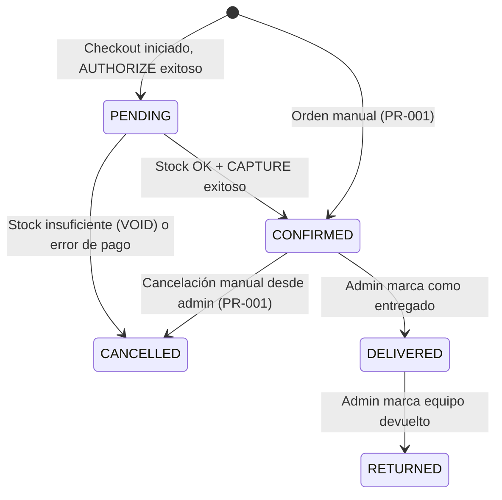
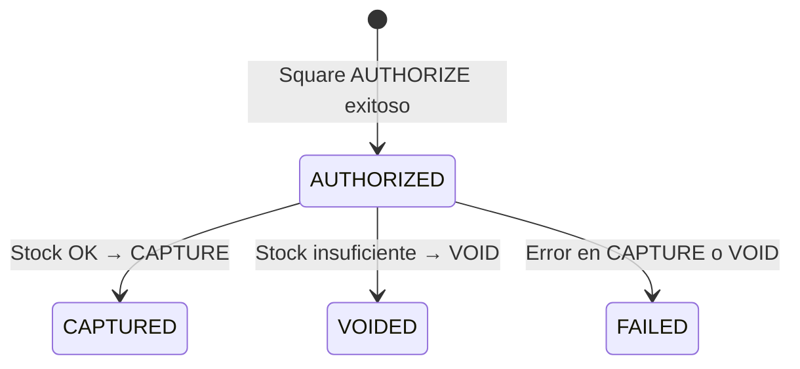

# Flujos — Festejos Aurora

## Flujo 1: Reserva y Checkout

El flujo principal del negocio. El cliente navega el catálogo, selecciona fechas y productos, completa el checkout con sus datos de contacto, y paga el 50% de anticipo con tarjeta. El sistema valida disponibilidad de forma atómica para evitar overbooking.

---

## Flujo 2: Verificación de Disponibilidad (Lógica Core)

Cómo el sistema calcula unidades disponibles para un rango de fechas dado, considerando tanto productos FIXED (brincolines) como PER_UNIT (sillas).

---

## Flujo 3: Gestión desde el Panel Admin

La administradora gestiona pedidos, inventario y calendario desde `/admin`. No hay notificaciones automáticas — la admin coordina todo manualmente por teléfono/email.

### Reglas clave de órdenes manuales (PR-001)

- Sólo `ROOT`/`ADMIN` ven los botones "Crear orden", "Marcar como pagada" y "Cancelar". `EMPLOYEE` no.
- El admin puede reservar **HOY** desde el sheet (asimétrico con el carrito público que exige `>= mañana`).
- Las órdenes manuales no llaman a Stripe ni envían email; persisten `payment_method = CASH | TRANSFER`.
- Stripe siempre persiste `payment_method = CARD`. Las órdenes Stripe se confirman vía webhook, no con el botón "Marcar como pagada".
- Cancelar es idempotente: rechaza segundas llamadas en `CANCELLED`/`DELIVERED`/`RETURNED`.
- Ver [ADR-007](decisions/adr-007-manual-orders-and-payment-method.md) para el detalle de decisiones.

---

## Máquina de Estados: Order

| Estado | Descripción |
|---|---|
| PENDING | Anticipo autorizado en Square, pendiente de confirmar disponibilidad |
| CONFIRMED | 50% capturado, equipo apartado para las fechas |
| DELIVERED | Equipo entregado al cliente, 50% restante cobrado en efectivo |
| RETURNED | Equipo devuelto, ciclo completo |
| CANCELLED | Pedido cancelado (VOID en Square o cancelación manual) |

---

## Máquina de Estados: PaymentStatus

